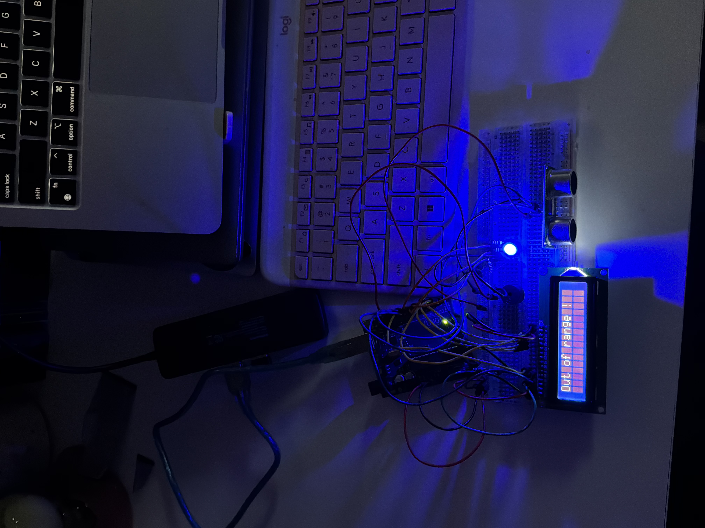

# Arduino Distance Sensor 🚨
An ultrasonic distance logger with RGB LED color alerts and buzzer — like a real parking sensor!

# Demo

# About This Project
My name is Xylina D and this is my second Arduino project. This project simulates the kind of proximity and distance sensing used in aerospace and robotics applications.

# What It Does

Measures distance in real time using an HC-SR04 ultrasonic sensor
Displays live distance readings on an LCD1602 screen
RGB LED changes color based on distance:

🟢 Green = far (25cm+) 
🟠 Orange = medium (10-25cm) 
🔴 Red = very close (under 10cm)  
🔵 Blue = out of range

Buzzer beeps faster as something gets closer
Shows "Out of range!" when nothing is detected

Components Used

Arduino UNO R3
HC-SR04 Ultrasonic Sensor
LCD1602 Display
RGB LED
Passive Buzzer
220 ohm Resistors (x3)
Breadboard & Jumper Wires

# What I Learned

How ultrasonic sensors measure distance using sound waves
How to use the map() function to convert sensor values
How to control an RGB LED with PWM signals
How to use tone() and noTone() for buzzer control
How to manage multiple components reacting to the same input simultaneously

# How It Works
The HC-SR04 sends out a sound pulse and measures how long it takes to bounce back. The Arduino converts that time into a distance in centimeters. Based on that distance the LED changes color and the buzzer adjusts its beeping speed — just like a real parking sensor!

Built by Xylina D — Phoenix College
